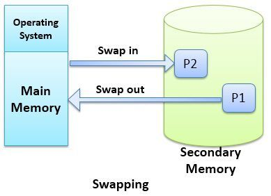
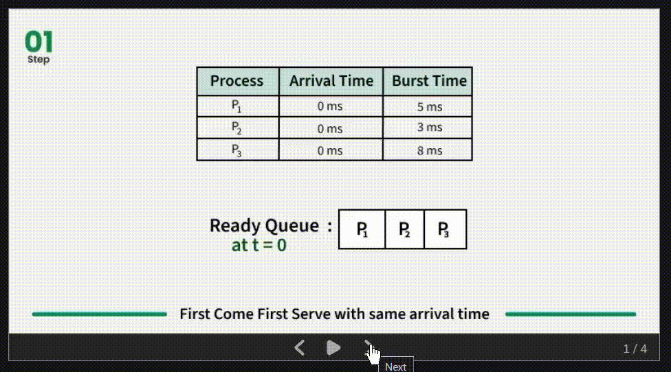

### Task of OS
- Resource allocation for various apps and processes. ( **Resource management** ) 
- Acts as an **interface** between user and hardware.
- Helps in upholding **DRY principle**.
    - Dry principle : **Don't Repeat Yourself**.
    - It means that we're supposed to create a code that can be used everywhere for the same use case.
    - Example : writing the print function for once and using everywhere in the code. 
    - OS helps to uphold the dry principles by providing a mechanism for the application to manage memory and resources. 

    - Without the availability of any pre-defined memory management in the device, the application developers are supposed to write the code for memory management themselves thereby creating huge heaps of code apart from the main application's code. 

- Provides Isolation and Protection: 
    - Provides a logical management of memory for applications in Isolation. 
    - Keeps the memory allocation of different applications separate. 
- OS is nothing but a software that manages all the resources of a computer i.e **Software and Hardware**
and provides an environment in which user can execute a program in a convenient manner.

----

### GOAL OF OS 
- Max utilization of CPU 
- Avoid **process starvation** - i.e no process is pending due to lack of computational resources.  
- High priority execution - i.e executes the job first which has high priority. 

---- 

### Types of OS 
- Single process OS : One process at a time.
- **Batch Processing OS** :
    - Similar jobs are put in a batch and then batches are sequentially sent for processing. 
- **Multi Programming OS** :
    - Single CPU only , but the queue has many jobs. 
    - If any job goes into a wait state or waits for an IO, the OS schedules it and sends it to the CPU.
    

    |${J_1}$|${J_2}$|${J_3}$|${J_4}$|
    |------|------|------|------|

    

    - here suppose $J1$ was assigned to the CPU, but due to some reason, ${J_2}$ went into an IO operation and in the meantime the CPU is Idle, so to maximise the CPU utilization , $J_2$ is sent to the CPU for processing. 
    - **Context Switching** : In short, saving the state of a process currently running process  and continuing the with the last saved state / starting of another process. 

- **Multi-Tasking OS** :
    - Works with Single CPU. 
    - Provides context switching. 
    - provides **time sharing** :
        - Instead of any process going into IO and then allocating the CPU resources to another process, we would rather allot a time **quantum to each process.**
        - say the time quantum is $100ms$, this means after $100ms$ of runtime of a process, we assign the CPU to another process for the same time quantum. 
        - This reduces process starvation as almost every process who needs resources get to utilize the CPU once.   
        - A high priority job can be executed in this format as there is the functionality of context switching. 

- **MULTI PROCESSING OS**: 
    - Time Sharing as the previous system is available. 
    - Context switching is also available. 
    - Here $\textbf{number of cpu}\geq 1$
    - here if one CPU is occupied then the other CPU can process it.
    - If one CPU fails , the other CPU compensates making this reliable. 
- **DISTRIBUTED OS**:
    - The CPU's are connected via a network instead of being hardcoded into a single device. 
    - Each CPU may have different computational power. 
    - They can be called as Loosely Coupled Autonomous Interconnected CPUs
    - There can be multiple users and jobs. 
- **REAL TIME OS**: 
    - Performs Computation without any delay. 
    - Error Free OS. 

---

- **PROCESS** : Program under execution.

- **THREAD** : The smallest task that can be independently executed. 
     - Suppose we have an image converter. Now at a time , it can only convert a $100 \times 100 $ image to a specific type. 
     - Now we got an input image of $100 \times 200$. 
     - So to process this we break this image into 2 parts of $100 \times 100 $ each and then process it. 
     - Since processing of each part is an independent process and doesn't require the dependency on any-other process, therefore we can run this process in parallel. 
     - Suppose this Conversion process is called $P_1 \text{ and } P_2$. Since these process are independent, we can assign a thread to each process say $T_1 \text{ and } T_2$. 
     - Now suppose processing of a single $100 \times100$ image takes $10\text{ seconds }$. 
     - Therefore the sequential process would take $10+10=20\text{ seconds. }$. 
     - Whereas the threaded process would take up 
    $10\text{ seconds }$. 
    - **Note that this kind of process would only be possible in a multi cpu architecture where one thread would run on one cpu ( i.e multiprocessing systems)**.

----

| **Multi-Tasking**|**Multi-Threading**|
|-----------------|-----------------|
|This is for more than one process competing with each other for resources on a single CPU. |Here we work with more than one Threads i.e sub-processes within a process.|
|This is within the processes. Therefore the concept of Isolation and memory protection is crucial. |No such Concept of Isolation and memory protection exists. This is because the memory allocated to a process is fixed and thereby subprocesses/threads need to use the same memory assigned to the process. |
|Here processes are scheduled|Here the sub-processes withing the processes are scheduled.|

---

|**THREAD CONTEXT SWITCHING** | **PROCESS CONTEXT SWITCHING**|
|-----|-----|
|the change of memory space doesn't happen while the context switching of threads. | memory space is changed as far as context switching b/w processes is concerned.|
|Since the addresses are same, therefore this switching is faster| Since there is change of address, therefore it's slow.|
|CPU cache state is preserved because one thread may require the data produced or computed by the previous thread.|CPU cache is flushed every-time as the process is totally different (in most of the cases).|

----

### COMPONENTS OF OS : 
- **User Space** :
    - This is the place where applications run. 
    - It has no hardware access. 
    - Provides a convenient space for user interaction.
    - Includes : 
         - **GUI** : Graphic User Interface
         - **CLI** : Command Line Interface
- **Kernel** : 
    - This is the space meant for developers who want to work around the hardware of the system.
    - Performs process management: 
        - Includes process : 
             - Creation 
             - Termination
    - Thread Scheduling 
    - Context Switching
    - Process Synchronization
    - Process communication
    - Memory Management 
        - Allocate Memory 
        - De-allocate Memory
        - Free Space management
    - File Management 
         - Create 
         - Delete 
    - Directory management: 
    - I/O management
        - Spooling 
        - Buffering 
        - Caching
---

### Types of Kernel 
- **Monolithic Kernel**
     - All tasks like Process , File, I/O etc are 
     present in a single kernel. 
     - Inter-process communication is fast. 
     - Kernel is Bulky!
     - Less Reliable : if one component fails, whole kernel fails. 
- **Micro Kernel**
     - Only Major functionalities are implemented in the kernel, rest are implemented in the User Space only. 
    - This is less bulky
    - This is somewhat more reliable. 
    - Performance is reduced as the switch between User mode and kernel mode  is very frequent as some functionalities are present in the kernel and some in user space, so to access them switching is needed. 

- **NOTE** That the communication between User space and kernel space happens via **IPC**: Inter Process Communication. 
    - **SHARED MEMORY** : Here we write the information in a common memory accessible by both the spaces. 

    - **Message passing** : OS provides some system calls where we establish a logical pipe between both the Processes using which communication is done. 

- **Hybrid Kernel**: 
     - Here only file management was a part of the user space.
     - Rest of the systems like I/O, memory management etc is handled by Kernel only. 
--- 
###  SYSTEM CALLS

- This is method by which applications running in user space can connect with Kernel space for resources. 
- It's done via **SCI: System Call Interface**. 
- Example : 
     - Suppose we want to create a folder. Now once we click the `make new folder` button, a command is executed `mkdir`. 
     - That command in turn goes to the SCI where there is an implementation of code for this `mkdir` process. 
    - Once the implementation is found, kernel space runs this implementation and applied the operation on the hardware of the system. 

- One Quick Question : How is this switch between User mode and Kernel mode happens ? 
- When a process is executed, there is a software interrupt gets called .
- whenever a software interrupt is called, the switch occurs. 

--- 

### Types of System calls : 
- There are 5 types of system calls  :
    - Process Control
    - File Management
    - Device Management
    - Information Maintenance
    - Communication Processes

---

### How a Computer Starts ( Just the process ) : 

1) Power On :P
2) CPU loads the **BIOS**: Basic Input Output System ( latest BIOS is called **UEFI**: Unified Extensible Firmware Interface ). 
     - BIOS is nothing but a chip that has a code that has the information about the initialization of every program in the CPU.
3) BIOS runs test and initializes all the hardware
4) BIOS loads some settings that are stored in a memory area which is powered by a **CMOS Battery**
     - This CMOS battery is crucial. 
     - This CMOS battery is used to power that **memory area and the CPU clock**.
5) Now the BIOS program loads with the instructions fetched from that memory area and run Some **POST tests** :
     - **POST** : **Power On Self Test**
     - For each hardware there are corresponding test cases that ensure the proper functioning of that particular hardware. 
6) BIOS / UEFI hands-off to **Boot Device**: 
     - BOOT DEVICE is an memory area where the actual OS boot instructions are there .
    - BOOT devices can be : 
         - HDD
         - SSD
         - CD 
         - USB Drive
7) Boot Device executes the **Boot Loader** which is a program that turns on the actual OS.
     - Boot loader can be present in : 
         - **Master Boot Record (MBR)** : the area of a disk where the boot loader resides. This is present at the $0^{th}$ index of the disk. This is used by BIOS type boot system. 
        - **Extensible Firmware Interface (EFI) :** We create a whole separate partition in the disk for the boot loader. (Used by UEFI type boot systems)

8) **Boot Loader loads the full OS** :)

---- 

### $32$ Bit vs $64$ Bit systems: 
- No. of bits we can use in our system define the max addressing possible. 
- For a $32$ bit system, max to max $2^{32} $ addresses are possible which are close to $4$ GB of memory i.e these systems can't go beyond $4$ GB of RAM because they simply can't address more than $2^{32}$ addresses. 
- For a $64$ bit system, max to max $2^{64} $ addresses are possible which is a lot of memory to work with. so by adding more RAM storage we can easily scale up systems up to **$2^{32}$ GB** of RAM which is a lot of storage. 

- Performance of a $64$ Bits system is better.  

---- 

### TYPES OF STORAGES 

PRIMARY MEMORY : 

|REGISTER|
|-------|
|**CACHE**|
|**MAIN MEMORY**|

SECONDARY MEMORY
|ELECTRONIC DISK|
|----|
|**MAGNETIC DISK**|
|**OPTICAL DISK**|
|**MAGNETIC TAPES**|

---
### PROCESS SCHEDULING
- Process is a program that's ready to execute. 
- Now comes a question : How is a program converted into a process ? 
1. Load the program and static data into the memory. 
     - Here the static data is used for initialization of the program. 
2. We now allocate a runtime stack (a part of memory used to store the variable , function arguments and return values. )

3. Allocate heap memory that can be used for runtime allocation of memory. 

4. Perform and handle all I/O related tasks for the program. 

5. OS now hands over the control to the `main` section of the Program therefore **making the program a process**. 

### How A process looks like in memory : 

|Stack     |
|-----     |
| $\vdots$ |
| $\vdots$ |
| $\vdots$ |
| $\vdots$ |
|**Heap**  |
|**Data**  |
|**Text**  |

- Here text is the compiled code. 
- The Data part is the storage of Global variables or definitions that are needed for the code to run properly
- Stack and heap are the 2 different storages provided to the process. 
- Initially they are far away from each other. 
- As soon as one reached the other, either **StackOverflow** or **Out of Memory** error occurs. 

### Attributes of a process 
- All the processes running in the device are stored in a table called process table. 
- Each entry for a process is called a **PCB : Process Control Board**. 
    - PCB contains all the information about the process. 
    - It's a full on Data Structure.

|Process ID|
|-|
|**Program Counter**|
|**Process State**|
|**Priority**|
|**Register**|
|**Open Files List**|
|**Open Devices List**|

    - Process ID is a unique identifier for a particular process. 
    - Program Counter keeps the track of the index of next instruction to be executed. 
    - Process state stores the current state of the process.
    - 
    - Priority variable  decides the hierarchy of execution of the process. 
    -  Registers variable maintains the address of the registers that saves the data related to the process like variables.
    - Open File List stores the info of the files opened by the process while it was execution. 
    - Open Device List stores the info of the devices that the process was needing to execute. 

----

### PROCESS STATE 
1) New State : the process of conversion of Program to a process. 
2) Ready State : The state where the process is stored in the ready queue and is waiting to be executed. 
3) Running State : CPU has been allocated to the process and is now running. 
4) Waiting State : the process waits for IO.
5) Termination state : process is finished :skull:.

- The job of sending the processes from the ready queue to the CPU for processing is done by **DISPATCHER**

- In case where the time quantum of the process is over, then the process goes back into the ready queue instead of the waiting state.

- If the process is in the waiting state, then it goes to the ready queue not the running state back directly. 

- **Job Scheduler / Long Term Scheduler** sends the processes in the Job queue ( which are in new state) to the ready queue (where they are in a ready state). 

- Scheduling the processes from Ready queue ( where they are in a ready state ) to CPU ( where they'll be in running state) is done by **CPU SCHEDULER / SHORT TERM SCHEDULER**.

- The actual transfer of processes from Ready queue to the CPU is done by **SCHEDULER DISPATCH**.

- **NOTE** that the terms long term scheduler and short term schedulers are totally dependent on the frequency of their use. 

- **DEGREE OF MULTI PROGRAMING** : The max number of jobs that can stay in the ready queue at any given time. This is regulated by the **JOB SCHEDULER / LONG TERM SCHEDULER**.

- This is because **LTS/Job Scheduler** is the One that takes up processes and puts them in the ready queue .

- Medium Term Scheduler :
     - At times due to high degree of multi-programming , the ready queue of the system becomes huge and maintaining such a huge queue is expensive memory wise. 
     - Furthermore there are processes which if sent to the CPU will consume all the memory available. 
     - To tackle all this, we use MTS. 
     - We create a separate area in memory called Swap space. 
     - We swap out the processes to this Swap space. 
     - This swap space in present in  Secondary space .
     - Once the resources are there to run the swapped processes, we send them back to the ready queue for processing. 
     - This whole process is called **swapping**. 

### Context Switching
- Suppose we want to perform context switching in between $P_{1} \text{ and } P_{2}$ and currently $P_{1} $ is under execution. 

- To stop  $P_{1} $ and execute $P_{2} $, we save the current Program Counter value in the registers to the PCB of $P_{1} $ along with the data and the state of $P_{1} $.

- Then we load the program counter , state and other information for $P_{2} $ . 

- This process  of context switching is an User Overhead. This means that while the process of context switching is happening , there is not computation happening that the CPU does. 

### Orphan Process 
- We know that any process running in the CPU are made by some parent process using `fork` command. 
- Now suppose some retarded programmer wrote a code where he is **creating child processes** but when the **parent process raised some exception or error**, the **parent process get terminated instantly leaving it's child process parentless or ORPHAN**. 

- Ideally what should have happened is that the parent process should have waited for the child process to terminate before terminating itself. 

- So what OS does is that it assigns that parentless child process to the first process of the OS i.e the **`init`** process which has a PID of $1$. 

### Zombie Process :skull:
- A process which has finished executing but has the entry in the process table . 
- Generally child procesess are the one to be converted into zombie process.
- whenever a process exits , it free ups the resources allocated to it. But in the case of zombie process the information of availability of those freed resources isn't updated in the process table of the OS . 
- Due to non deletion of entries in the process table , the process table keeps growing. 
- The entry of such process is only deleted when the parent process of the zombie process is able to read the exit status of the process and thereby removing it's entry from the process table. 

---- 

### Types of Scheduling
**Non Pre-emptive Scheduling** :
- If the process is assigned the CPU, it will hold on the CPU until it terminates or waits. 
- No concept of time quantum in this kind of scheduling algorithm. 

**Pre-emptive Scheduling** :
- Even if the process is assigned the CPU, the resources can be revoked from the process and sent to wait state. 
- concept of time quantum exists in this kind of scheduling algorithm. 

- **PROCESS STARVATION** is high in non pre-emptive than pre-emptive scheduling as the processes in the ready queue will be waiting until the process holding CPU is terminated. 
 
### GOALS OF CPU SCHEDULING ALGOS : 
1) Max CPU utilization .
2) Minimum **Turn Around Time** : Time between the process entering the ready queue and termination. This means that we want every process entering the ready queue to terminate as soon as possible. 
3) Minimum **Wait Time** : The time for which the process was waiting for CPU being allocated to it. We want that the process shouldn't be kept waiting. 
4) Minimum **Response Time** : Time between the process entering the ready queue and getting the CPU for the very first time.   
5) Maximum Throughput : Number of processes per unit time. 

### SOME IMPORTANT TIMES :
- **THROUGHPUT** : Number of processes completed per unit time. 
- **ARRIVAL TIME** : Timestamp at which the process arrived in the ready queue. 
- **BURST TIME** : Time required by process for it's execution ( given the process is the single owner) .
- **TURNAROUND TIME** : Time interval between the first time the process enters the ready queue and the process termination. 
- **WAIT TIME** : Time process spends waiting for getting the CPU resources allocated. 
- **RESPONSE TIME** : Time between the process entering the ready queue and getting the CPU for the very first time.
- **COMPLETTION TIME** : Time taken for the process to complete. 

### FIRST COME FIRST SERVE : 
- The first process which comes first into the ready queue is assigned the cpu first. 

- Here in this case we have the same arrival time. So the CPU will be assigned to the one coming first. 

